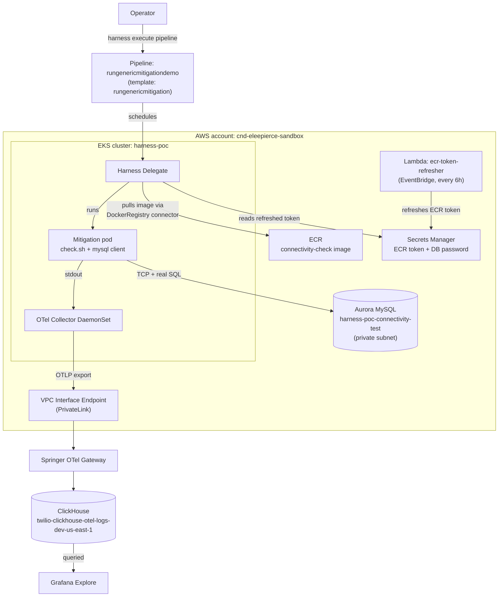

# Architecture

End-to-end flow validated by this POC: invocation → execution → database access → observability.

```mermaid
flowchart TD
    Op["Operator"] -->|"harness execute pipeline"| Pipeline["Pipeline: rungenericmitigationdemo<br/>(template: rungenericmitigation)"]

    subgraph AWS["AWS account: cnd-eleepierce-sandbox"]
        subgraph EKS["EKS cluster: harness-poc"]
            Delegate["Harness Delegate"]
            Pod["Mitigation pod<br/>check.sh + mysql client"]
            Collector["OTel Collector DaemonSet"]
        end
        Aurora[("Aurora MySQL<br/>harness-poc-connectivity-test<br/>(private subnet)")]
        ECR["ECR<br/>connectivity-check image"]
        SecretsMgr["Secrets Manager<br/>ECR token + DB password"]
        Lambda["Lambda: ecr-token-refresher<br/>(EventBridge, every 6h)"]
        VPCEndpoint["VPC Interface Endpoint<br/>(PrivateLink)"]
    end

    Springer["Springer OTel Gateway"]
    ClickHouse[("ClickHouse<br/>twilio-clickhouse-otel-logs-dev-us-east-1")]
    Grafana["Grafana Explore"]

    Pipeline -->|"schedules"| Delegate
    Delegate -->|"pulls image via<br/>DockerRegistry connector"| ECR
    Delegate -->|"reads refreshed token"| SecretsMgr
    Lambda -->|"refreshes ECR token"| SecretsMgr
    Delegate -->|"runs"| Pod
    Pod -->|"TCP + real SQL"| Aurora
    Pod -->|"stdout"| Collector
    Collector -->|"OTLP export"| VPCEndpoint
    VPCEndpoint --> Springer
    Springer --> ClickHouse
    ClickHouse -->|"queried"| Grafana
```
