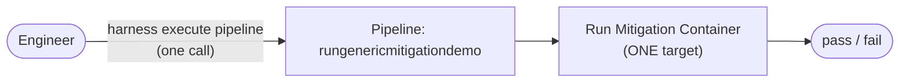
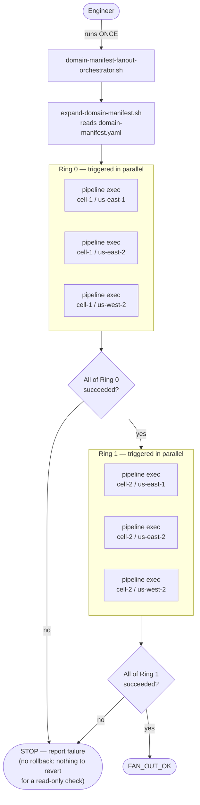

# Fan-out: before vs. after

Two different things changed control flow this week — the template becoming mitigation-agnostic (v2.0.0) and the domain-manifest-driven fan-out orchestrator. This doc is specifically about the second one: how a mitigation actually gets *invoked*, before vs. after.

## Before: one pipeline, one target, one manual trigger

An engineer (or, this whole POC, me via the Harness CLI) triggers the pipeline directly, once, against one hardcoded target. One call in, one result out. No concept of "cells" or "rings" exists anywhere in this picture — it's the same shape as running a script against a single host.

## After: a script drives ring-ordered, parallel-within-ring fan-out

The engineer still only does one thing — runs the orchestrator script once. Everything after that is the *script's* doing: it reads the real domain-manifest schema, expands it into ring-ordered cells (ascending ring number, cells within a ring in parallel, matching `cn-monorepo manifest expand --granularity=cell`'s real semantics), triggers one pipeline execution per cell via the same Harness CLI call as "before" — just looped — and gates ring N+1 on ring N fully succeeding.

## What's still true in both

The actual pipeline being triggered (`rungenericmitigationdemo`) and the actual container doing the check are unchanged between the two diagrams — same `harness execute pipeline` call underneath, same mitigation logic. What changed is entirely the *layer above it*: whether a human decides "run this one target" each time, or a script decides "run these N targets, in this order, stopping if any ring fails."

## What neither diagram is: DO's real model

Both of these still have a human (or a script standing in for one) manually starting the whole thing from a local terminal, with local Harness CLI credentials. Deployment Orchestration's actual model replaces the orchestrator box in the "after" diagram with a *permanent pipeline living inside Harness itself* — triggered by naming a domain, not by running a script — with real approval gates and rollback built in natively. That's a third diagram, not drawn here since it's not something we've built or run yet; see `ssm_divergence_effort.md`'s "how it compares" notes for that side of it.
